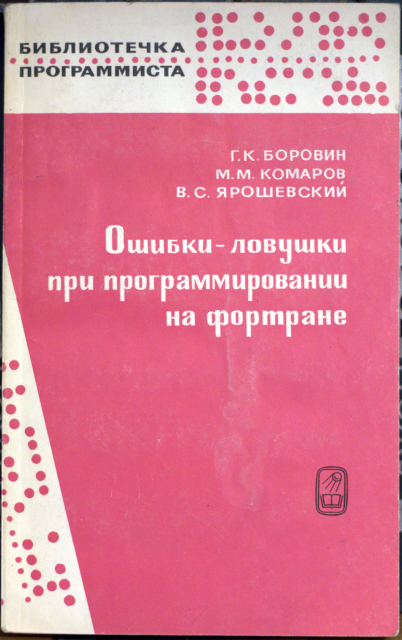
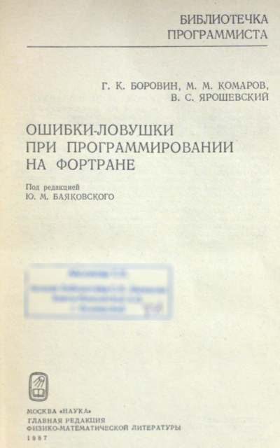

## ББК 22.18

## Боровин Г.К., Комаров М.М., Ярошевский В.С., Ошибки-ловушки при программировании на фортране. Под редакцией Ю. М. Баяковского. М.: «Наука», 1987

#### 144 c.

Основное содержание книги составляют задачи, цель которых - поиск ошибок в приведенных программах на фортране. Задачи охватывают ШИРОКИЙ спектр ошибок, относящихся практически ко асгт аспектам языка фортран: синтаксис языка, типы данных, управляющие операторы, модульная организация программ, представленве данных и арифметические операции, операторы ввода-вывода. Приводятся подробные решения детально рассмотрены источники возникновения ошибок. Обсуждается стиль программирования как главный фактор, влияющий на качество программы.

Книга рассчитана как на начинающих, так и на опытных программистов. Многие вопросы представляют интерес при программировании на других языках.

Рис. 3. Библиогр. 44 назв.

Рецензент член-корреспондент АН ГССР Л. Н. Королев

**Тираж:** 116.000 экземпляров

## Изображения

