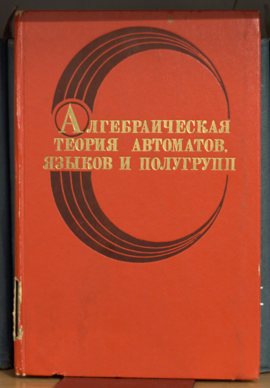
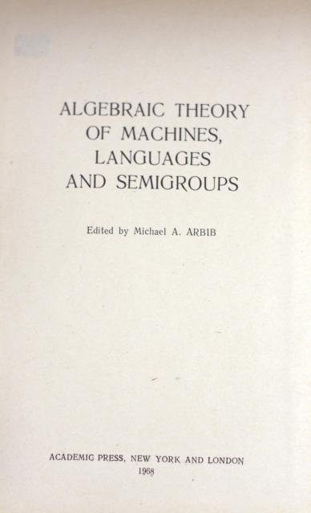

## А79

## Алгебраическая теория автоматов, языков и полугрупп. Под редакцией М. Арбиба. Перю с англ. М., "Статистика", 1975

#### 335 c.; с илл.

Монография посвящена рассмотрению математического аппарата количественного и качественного анализа АСУ. Конечные автоматы благодаря их прoстой реализуемости на ЭВМ имеют значительные преимущества по сравнению с другими моделями. Авторы знакомят читателей с основными достижениями в этой области.

Книга рассчитана на разработчиков АСУ и цифровых средств вычислительной техники, на математиков, работающих в области системного математического обеспечения и построения проблемно-ориентированных алгоритцнче-ских языков, а также на специалистов по системному анализу и моделированию сложных объектов.

## Изображения

