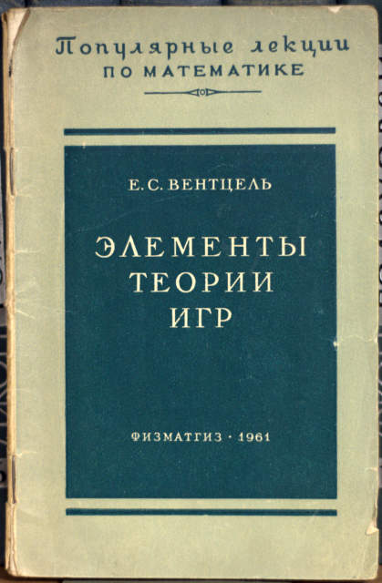

## Элементы теории игр. Е.С. Вентцель М., «Государственное издательство физико-математической литературы», 1961

## АННОТАЦИЯ

Книга представляет собой популярное изложение элементов теории игр и некоторых способов решения матричных игр. Она почти не содержит доказательств и иллюстрирует основные положения теории примерами. Для чтения достаточно знакомства с элементами теории вероятностей и математического анализа.

Книга предназначена для популяризации идей теории игр, имеющей широкое практическое применение в экономике и военном деле.

**Тираж:** 40 000 экз.

## Изображения

