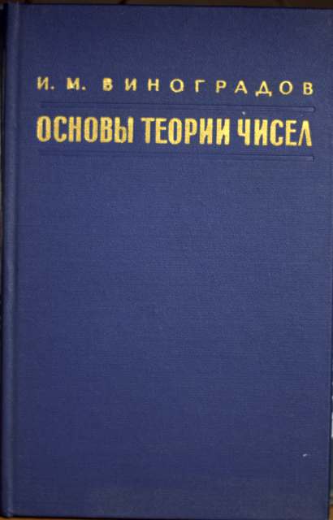
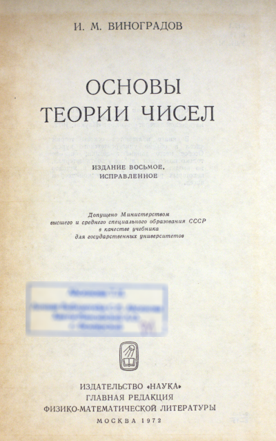

## 571.1; Б 49; УДК 511

## Виноградов И.М., Основы теории чисел. Под редакцией Ю. М. Баяковского. М.: «Наука», 1972

В книге излагаются основы теории чиселв объеме университетского курса. Особое место занимают задачи; они не только позволяют глубже усвоить материал, но вводят также в круг идей и методов некоторых разделов аналитической теории чисел.

**Тираж:** 35.000 экземпляров

## Изображения

