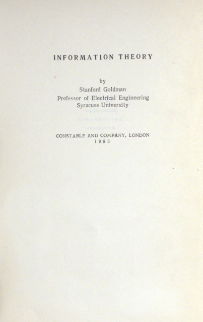

## Теория информации. Станфорд Голдман. Пер. с англ. М., «Издательство иностранной литературы», 1957

## АННОТАЦИЯ

«Теория информации» Голдмана является первой большой монографией по этому вопросу, выпускаемой на русском языке. Созданная за последнее десятилетие новейшая математическая дисциплина—теория информации—тесно связана с рядом теоретических и прикладных разделов науки: с теорией вероятностей, кибернетикой, радиотехникой и др.

Книга рассчитана ка широкий круг читателей, в первую очередь на инженеров-радиотехников и математиков. Она предполагает у читателя небольшую математическую подготовку, а именно владение элементами математического анализа и теории вероятностей.

**Тираж:** н.д.

## Изображения

